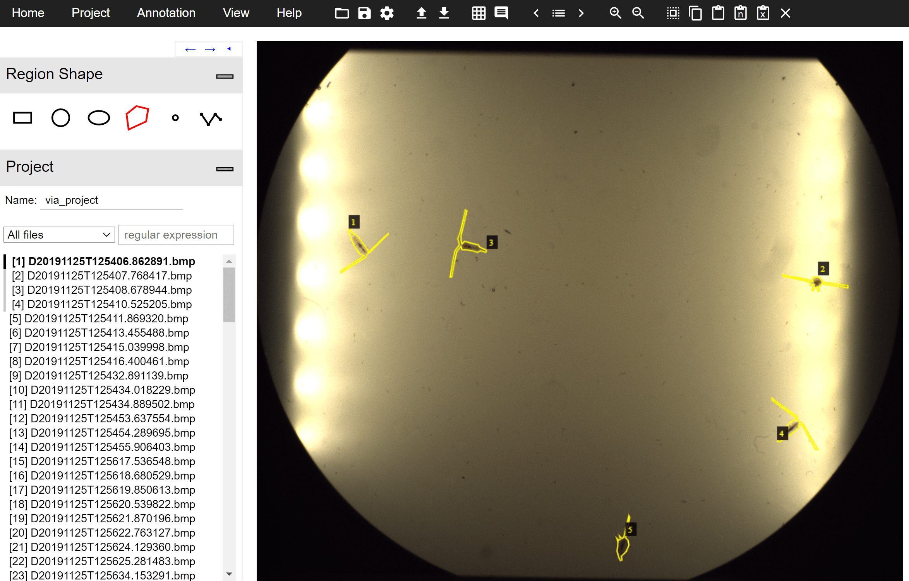
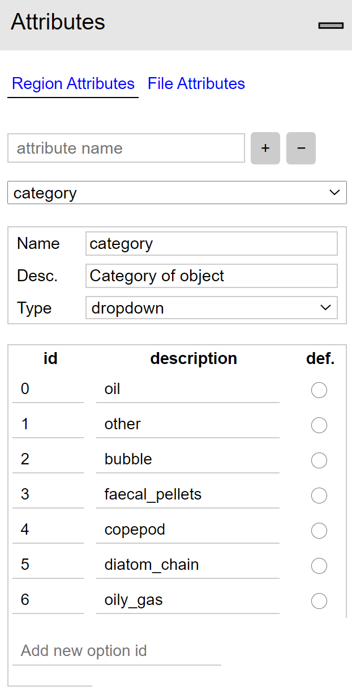
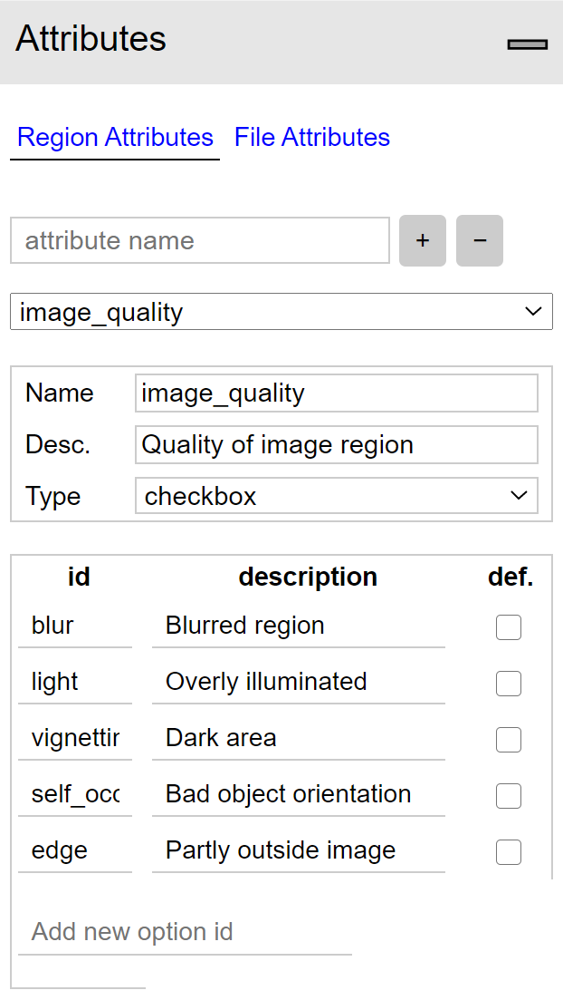

# Dataset

## Image Annotator

The custom dataset was labeled using the [VGG image annotator tool](https://www.robots.ox.ac.uk/~vgg/software/via/via_demo.html).

VGG Image Annotator is a simple and standalone manual annotation software for image, audio and video. VIA runs in a web browser and does not require any installation or setup. The complete VIA software fits in a single self-contained HTML page of size less than 400 Kilobyte that runs as an offline application in most modern web browsers.

VIA is an open source project based solely on HTML, Javascript and CSS (no dependency on external libraries). VIA is developed at the [Visual Geometry Group (VGG)](https://www.robots.ox.ac.uk/~vgg/) and released under the BSD-2 clause license which allows it to be useful for both academic projects and commercial applications.

This tool specifically was selected due to it's ease-of-use and  because it's available features fit ths necessary requirements for this project well.

  

| Category                                                       | Image quality                                                      |
| -------------------------------------------------------------- | ------------------------------------------------------------------ |
|   |  |

The category ids are indexed (1-indexed) to be compatible with the class indexes outputed from the original [PySilCam Suite](https://github.com/emlynjdavies/PySilCam/wiki).
The attributes in image_quality have the following ids: "blur", "light", "vignetting", "self_occlusion", "edge". These attributes of image quality are not preserved after processing the annotation files as the current method I am using this for doesn't require or support information like this. It is included hoewever because I see it as valuable data about the regions that can be put to use in future efforts.

It is recommended that all the attributes and values are set up before the labeling effort is started in order to have the options available to the regions from the start. If an attribute or a field is added after labeling is started and some regions already labeled should have this attribute applied to them, backtracking is necessary, but only if the newly added attribute applied to the previous regions.

When labeling I have been using the polygon region shape exclusively.

When exporting the annotations from the tool you can choose between exporting as csv, json or [coco format](https://cocodataset.org/#format-data), however I found the coco format option to not reliably export it to a valid coco format. Because of this I have been extracting and manipulating the annotation files using customly written code to format them properly for the needs of my project. I have not been using the csv format.

One of the drawbacks of the tool is that when resuming labeling after restarting the tool and uploading an exported anotation files, the region attributes have to be re-added. It is crucial to make sure the id's are exactly the same as before in order to preserve the format.

## [Annotation files](dataset/annotations)

These files apply to the images found in the path /mnt/DATA/copepod_lab_petridish/copepods on the NAS drive of the lab computer used for this project. The 5 first images in the directory (alphabetically orderd) are ommited as the these are not included in the STATS.csv output from the processing of these images by the PySilCam. This is because the background correction in that process utilizes the previous 5 images to subtractt the background of a given image.

| Files   |   Description |
| --------------------------------------------- | ---------------------------------------------- |
| <tt>via_export_{json,coco}_format.json</tt>   | unprocessed exported annotations from the tool |
| <tt>example_{coco,detectron2,json}format.json</tt> | short example files on how the annotaiton files for the coco format, detectron2 default format and the exported json format from the annotation tool respectively, are supposed to look like.|
| <tt>copepod_train_val_test_splits.json</tt> | contains the lists of images divided into each of the sets in the dataset. |
| <tt>coco_clean_{train,val,test}.json</tt>    <tt>default_detectron_{train,val,test}.json</tt> | finished annotation files on the proper format ready for use. It is important to note that the categories in the coco format are 1-indexed while in the default detectron2 format they are 0-indexed |

## Register custom dataset with detectron2

Using [coco format](https://detectron2.readthedocs.io/tutorials/datasets.html) or building custom dataset from scratch with [code example](https://colab.research.google.com/drive/16jcaJoc6bCFAQ96jDe2HwtXj7BMD_-m5)
