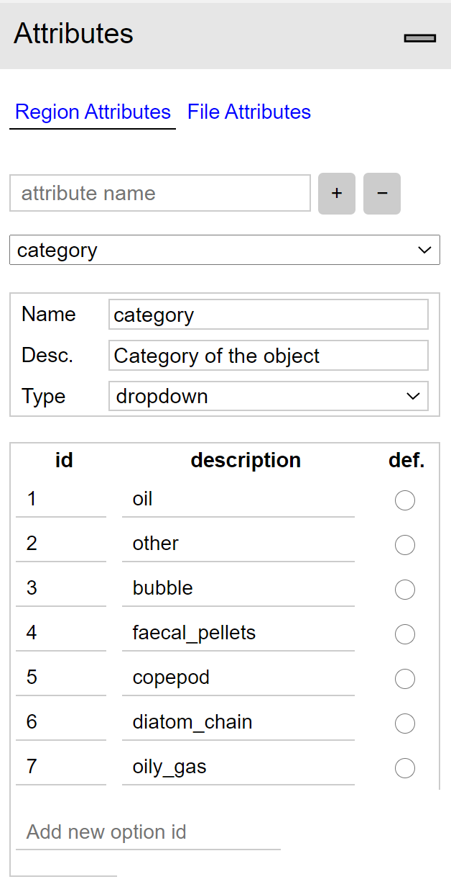

# Dataset

## Image Annotator

The custom dataset was labeled using the VGG image annotator tool.

VGG Image Annotator is a simple and standalone manual annotation software for image, audio and video. VIA runs in a web browser and does not require any installation or setup. The complete VIA software fits in a single self-contained HTML page of size less than 400 Kilobyte that runs as an offline application in most modern web browsers.

VIA is an open source project based solely on HTML, Javascript and CSS (no dependency on external libraries). VIA is developed at the Visual Geometry Group (VGG) and released under the BSD-2 clause license which allows it to be useful for both academic projects and commercial applications.

This tool specifically was selected due to it's ease-of-use and  because it's available features fit ths necessary requirements for this project well.

  

Region attributes
:-------------------------:                  |  :-------------------------:
   |  

When exporting the annotations from the tool you can choose between exporting as csv, json or [coco format](https://cocodataset.org/#format-data), however I found the coco format option to not reliably export it to a valid coco format. Because of this I have been extracting and manipulating the annotation files using customly written code to format them properly for the needs of my project. I have not been using the csv format.

## [Annotation files](dataset\annotations)

The via_export_{json,coco}_format.json files are the unprocessed exported annotations from the tool.

The example_{coco,detectron2,json}format.json files are short example files on how the annotaiton files for the coco format, detectron2 default format and the exported json format from the annotation tool respectively, are supposed to look like.

The file named copepod_train_val_test_splits.json contains the lists of images divided into each of the sets in the dataset.

The coco_clean_{train,val,test}.json and default_detectron_{train,val,test}.json are finished annotation files on the proper format ready for use

## Register custom dataset with detectron2

Using [coco format](https://detectron2.readthedocs.io/tutorials/datasets.html) or building custom dataset from scratch with [code example](https://colab.research.google.com/drive/16jcaJoc6bCFAQ96jDe2HwtXj7BMD_-m5)
